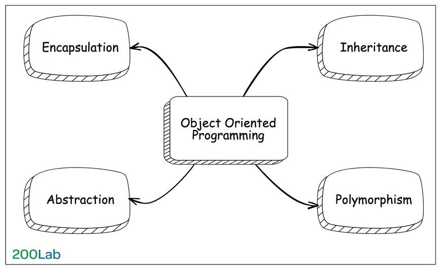
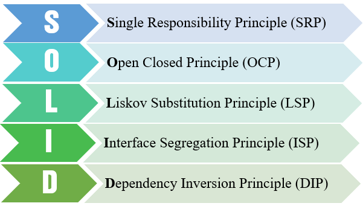
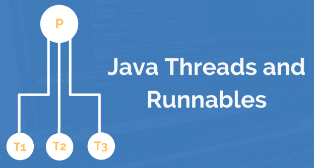

# Những câu hỏi phỏng vấn có thể được hỏi

## 1 - Những câu hỏi về android:
- `Activity`, `Fragment`,...lifecycle, tương tác và truyền dữ liệu giữa activity và fragment,...
- Layouts: `Relative`, `Linear`, `Contraint`,...
- Jetpack:: `ViewModel`, `livedata`, `Room`, `Binding`,...
- Unit test (`JUnit`, `Mock`), UI test (`Espresso`,...)
- 3rd libs: `Retrofit`, `Google SDK`, `Facebook SDK`,...
- `RxJava`, `RxKotlin`, `Coroutine`,...


## 2 - Những câu hỏi thốn hơn
- `OOP`
- `SOLID`
- `Design Pattern`
- `Multi threads`
- Tối ưu `performance`
- Phát hiện và xử lý `Memory leak`

# Múc!
## OOP - *Object-Oriented Programming*



- `Định nghĩa`: OOP là viết tắt của "Object-Oriented Programming" (Lập trình Hướng đối tượng), một phương pháp lập trình mà trong đó các chương trình được tổ chức xung quanh các đối tượng (objects), mà là các thực thể có thể chứa dữ liệu (data) trong các biến và thực hiện các hành động (actions) thông qua các phương thức (methods).


    Mô hình này giúp tăng tính cấu trúc và tái sử dụng mã lập trình, làm cho việc phát triển và duy trì các ứng dụng trở nên dễ dàng hơn.

- `4 tính chất cơ bản`:
  - Tính trừu tượng (`abstract`) --> Tổng quát hóa một cái gì đó mà không cần đi vào chi tiết
  - Tính kế thừa (`inheritance`) --> Tái sử dụng thuộc tính và phương thức của class khác
  - Tính đóng gói (`encapsulation`) --> Đóng gói attributes, methods thành class, đóng gói các class thành package -> che giấu thông tin và đảm bảo sự toàn vẹn của dữ liệu.
  - Tính đa hình (`polymorphism`) --> *Overriding* (ghi đè) và *Overloading* (nạp chồng - các method cùng tên nhưng khác tham số đầu vào)

## SOLID




- `Định nghĩa`: SOLID là một nguyên tắc thiết kế phần mềm được đặt ra để tạo ra mã lập trình linh hoạt, dễ dàng bảo trì và mở rộng. Nó bao gồm năm nguyên tắc cơ bản:

- `Tóm tắt cơ bản`:
    - **`S`** - Single Responsibility Principle (SRP): Một class chỉ nên giữ 1 trách nhiệm duy nhất
    
    - **`O`** - Open/Closed Principle (OCP): Có thể thoải mái mở rộng 1 class, nhưng không được sửa đổi bên trong class đó
    
    - **`L`** - Liskov Substitution Principle (LSP): Các object của class con có thể thay thế class cha mà không làm thay đổi tính đúng đắn của chương trình.
      
    - **`I`** - Interface Segregation Principle (ISP): Thay vì dùng 1 interface lớn, ta nên tách thành nhiều interface nhỏ, với nhiều mục đích cụ thể.
      
    - **`D`** - Dependency Inversion Principle (DIP): 
        1. Các module cấp cao không nên phụ thuộc vào các modules cấp thấp.
           Cả 2 nên phụ thuộc vào abstraction.
        2. Interface (abstraction) không nên phụ thuộc vào chi tiết, mà ngược lại.
       ( Các class giao tiếp với nhau thông qua interface, không phải thông qua implementation.)
           

## Thread

- ### Khai báo
    - #### Extends Thread
    ``` ```
    ```java 
    public class MyThread extends Thread {
        public void run() {
            // Các hành động mà luồng này sẽ thực hiện
            System.out.println("Hello from MyThread!");
        }
    
        public static void main(String[] args) {
            MyThread thread = new MyThread();
            thread.start(); // Bắt đầu thực thi luồng
        }
    }
  ```
    - #### Implement Runnable
    ```java
      public class MyRunnable implements Runnable {
        public void run() {
            // Các hành động mà luồng này sẽ thực hiện
            System.out.println("Hello from MyRunnable!");
        }
    
        public static void main(String[] args) {
            Thread thread = new Thread(new MyRunnable());
            thread.start(); // Bắt đầu thực thi luồng
        }
    }
- ### Các phương thức trong Thread
    - `suspend()` : Đây là phương thức làm tạm dừng hoạt động của 1 luồng nào đó bằng các ngưng cung cấp CPU cho luồng này. Để cung cấp lại CPU cho luồng ta sử dụng phương thức resume(). Cần lưu ý 1 điều là ta không thể dừng ngay hoạt động của luồng bằng phương thức này. Phương thức suspend() không dừng ngay tức thì hoạt động của luồng mà sau khi luồng này trả CPU về cho hệ điều hành thì không cấp CPU cho luồng nữa.
    - `resume()` : Đây là phương thức làm cho luồng chạy lại khi luồng bị dừng do phương thức suspend() bên trên. Phương thức này sẽ đưa luồng vào lại lịch điều phối CPU để luồng được cấp CPU chạy lại bình thường.
    - `stop()` : Luồng này sẽ kết thúc phương thức run() bằng cách ném ra 1 ngoại lệ ThreadDeath, điều này cũng sẽ làm luồng kết thúc 1 cách ép buộc. Nếu giả sử, trước khi gọi stop() mà luồng đang nắm giữa 1 đối tượng nào đó hoặc 1 tài nguyên nào đó mà luồng khác đang chờ thì có thể dẫn tới việc sảy ra deadlock.
    - `destroy()` : dừng hẳn luồng.
    - `isAlive()` : Phương thức này kiểm tra xem luồng còn active hay không. Phương thức sẽ trả về true nếu luồng đã được start() và chưa rơi vào trạng thái dead. Nếu phương thức trả về false thì luồng đang ở trạng thái “New Thread” hoặc là đang ở trạng thái “Dead”
    - `yeild()` : Hệ điều hành đa nhiệm sẽ phân phối CPU cho các tiến trình, các luồng theo vòng xoay. Mỗi luồng sẽ được cấp CPU trong 1 khoảng thời gian nhất định, sau đó trả lại CPU cho hệ điều hành (HĐH), HĐH sẽ cấp CPU cho luồng khác. Các luồng sẽ nằm chờ trong hàng đợi Ready để nhận CPU theo thứ tự. Java có cung cấp cho chúng ta 1 phương thức khá đặc biệt là yeild(), khi gọi phương thức này luồng sẽ bị ngừng cấp CPU và nhường cho luồng tiếp theo trong hàng chờ Ready. Luồng không phải ngưng cấp CPU như suspend mà chỉ ngưng cấp trong lần nhận CPU đó mà thôi.
    - `sleep(long`) : tạm dừng luồng trong một khoảng thời gian millisecond.
    - `join()` : thông báo rằng hãy chờ thread này hoàn thành rồi thread cha mới được tiếp tục chạy.
    - `join(long`) : Thread cha cần phải đợi millisecond mới được tiếp tục chạy, kể từ lúc gọi join(long). Nếu tham số millis = 0 nghĩa là đợi cho tới khi luồng này kết thúc.
    - `getName()` : Trả về tên của thread.
    - `setName(String` name) : Thay đổi tên của thread.
    - `getId()` : Trả về id của thread.
    - `getState()`: trả về trạng thái của thread.
    - `currentThread()` : Trả về tham chiếu của thread đang được thi hành.
    - `getPriority()` : Trả về mức độ ưu tiên của thread.
    - `setPriority(int`) : Thay đổi mức độ ưu tiên của thread.
    - `isDaemon()` : Kiểm tra nếu thread là một luồng Daemon.
    - `setDaemon(boolean`): xác định thread là một luồng Daemon hay không.
    - `interrupt()` : làm gián đoạn một luồng trong java. Nếu thread nằm trong trạng thái sleep hoặc wait, nghĩa là sleep() hoặc wait() được gọi ra. Việc gọi phương thức interrupt() trên thread đó sẽ phá vỡ trạng thái sleep hoặc wait và ném ra ngoại lệ InterruptedException. Nếu thread không ở trong trạng thái sleep hoặc wait, việc gọi phương thức interrupt() thực hiện hành vi bình thường và không làm gián đoạn thread nhưng đặt cờ interrupt thành true.
    - `isInterrupted()` : kiểm tra nếu thread đã bị ngắt.
    - `interrupted()` : kiểm tra nếu thread hiện tại đã bị ngắt.

- ### Luồng Deamon
    - Java chia thread làm 2 loại: một loại `thông thường` và `Daemon Thread`. Chúng chỉ khác nhau ở cách thức ngừng hoạt động. Trong một chương trình các luồng thông thường và luồng Daemon chạy song song với nhau. *Khi tất cả các luồng thông thường kết thúc, mọi luồng Daemon cũng sẽ bị kết thúc theo bất kể nó đang làm việc gì*. 
    
    - Sử dụng `setDaemon(boolean)` để xác định một luồng là Daemon hoặc không. Chú ý, bạn chỉ có thể gọi hàm setDeamon(boolean) khi thread chưa được chạy.
    
    - Khi một luồng mới được tạo ra, nó được thừa hưởng đặc tính daemon từ luồng cha.

`Deamon thread thường dùng làm gì???? -> Gom rác: gom các tài nguyên không còn sử dụng để giải phóng bộ nhớ. Khi tất cả các luồng người dùng không còn hoạt động nữa luồng gom rác cũng bị dừng theo.`


