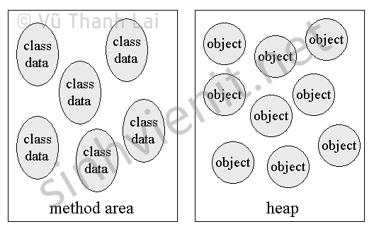
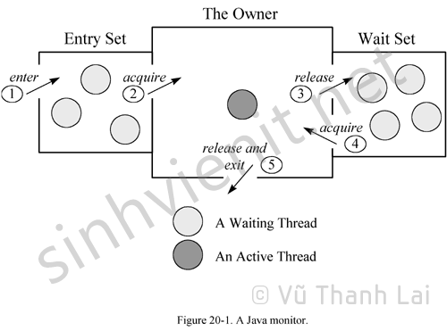
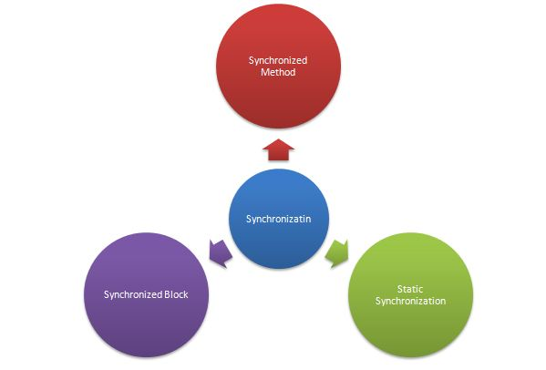

# Những câu hỏi phỏng vấn có thể được hỏi

## 1 - Những câu hỏi về android:
- `Activity`, `Fragment`,...lifecycle, tương tác và truyền dữ liệu giữa activity và fragment,...
- Layouts: `Relative`, `Linear`, `Contraint`,...
- Jetpack:: `ViewModel`, `livedata`, `Room`, `Binding`,...
- Unit test (`JUnit`, `Mock`), UI test (`Espresso`,...)
- 3rd libs: `Retrofit`, `Google SDK`, `Facebook SDK`,...
- `RxJava`, `RxKotlin`, `Coroutine`,...


## 2 - Những câu hỏi thốn hơn
- `OOP`
- `SOLID`
- `Design Pattern`
- `Multi threads`
- Tối ưu `performance`
- Phát hiện và xử lý `Memory leak`

# Múc!
## OOP - *Object-Oriented Programming*


- `Định nghĩa`: OOP là viết tắt của "Object-Oriented Programming" (Lập trình Hướng đối tượng), một phương pháp lập trình mà trong đó các chương trình được tổ chức xung quanh các đối tượng (objects), mà là các thực thể có thể chứa dữ liệu (data) trong các biến và thực hiện các hành động (actions) thông qua các phương thức (methods).


    Mô hình này giúp tăng tính cấu trúc và tái sử dụng mã lập trình, làm cho việc phát triển và duy trì các ứng dụng trở nên dễ dàng hơn.

- `4 tính chất cơ bản`:
  - Tính trừu tượng (`abstract`) --> Tổng quát hóa một cái gì đó mà không cần đi vào chi tiết
  - Tính kế thừa (`inheritance`) --> Tái sử dụng thuộc tính và phương thức của class khác
  - Tính đóng gói (`encapsulation`) --> Đóng gói attributes, methods thành class, đóng gói các class thành package -> che giấu thông tin và đảm bảo sự toàn vẹn của dữ liệu.
  - Tính đa hình (`polymorphism`) --> *Overriding* (ghi đè) và *Overloading* (nạp chồng - các method cùng tên nhưng khác tham số đầu vào)

## SOLID


- `Định nghĩa`: SOLID là một nguyên tắc thiết kế phần mềm được đặt ra để tạo ra mã lập trình linh hoạt, dễ dàng bảo trì và mở rộng. Nó bao gồm năm nguyên tắc cơ bản:

- `Tóm tắt cơ bản`:
    - **`S`** - Single Responsibility Principle (SRP): Một class chỉ nên giữ 1 trách nhiệm duy nhất
    
    - **`O`** - Open/Closed Principle (OCP): Có thể thoải mái mở rộng 1 class, nhưng không được sửa đổi bên trong class đó
    
    - **`L`** - Liskov Substitution Principle (LSP): Các object của class con có thể thay thế class cha mà không làm thay đổi tính đúng đắn của chương trình.
      
    - **`I`** - Interface Segregation Principle (ISP): Thay vì dùng 1 interface lớn, ta nên tách thành nhiều interface nhỏ, với nhiều mục đích cụ thể.
      
    - **`D`** - Dependency Inversion Principle (DIP): 
        1. Các module cấp cao không nên phụ thuộc vào các modules cấp thấp.
           Cả 2 nên phụ thuộc vào abstraction.
        2. Interface (abstraction) không nên phụ thuộc vào chi tiết, mà ngược lại.
       ( Các class giao tiếp với nhau thông qua interface, không phải thông qua implementation.)
           

## Thread

- ### Khai báo
    - #### Extends Thread
    ``` ```
    ```java 
    public class MyThread extends Thread {
        public void run() {
            // Các hành động mà luồng này sẽ thực hiện
            System.out.println("Hello from MyThread!");
        }
    
        public static void main(String[] args) {
            MyThread thread = new MyThread();
            thread.start(); // Bắt đầu thực thi luồng
        }
    }
  ```
    - #### Implement Runnable
    ```java
      public class MyRunnable implements Runnable {
        public void run() {
            // Các hành động mà luồng này sẽ thực hiện
            System.out.println("Hello from MyRunnable!");
        }
    
        public static void main(String[] args) {
            Thread thread = new Thread(new MyRunnable());
            thread.start(); // Bắt đầu thực thi luồng
        }
    }
- ### Các phương thức trong Thread
    - `suspend()` : Đây là phương thức làm tạm dừng hoạt động của 1 luồng nào đó bằng các ngưng cung cấp CPU cho luồng này. Để cung cấp lại CPU cho luồng ta sử dụng phương thức resume(). Cần lưu ý 1 điều là ta không thể dừng ngay hoạt động của luồng bằng phương thức này. Phương thức suspend() không dừng ngay tức thì hoạt động của luồng mà sau khi luồng này trả CPU về cho hệ điều hành thì không cấp CPU cho luồng nữa.
    - `resume()` : Đây là phương thức làm cho luồng chạy lại khi luồng bị dừng do phương thức suspend() bên trên. Phương thức này sẽ đưa luồng vào lại lịch điều phối CPU để luồng được cấp CPU chạy lại bình thường.
    - `stop()` : Luồng này sẽ kết thúc phương thức run() bằng cách ném ra 1 ngoại lệ ThreadDeath, điều này cũng sẽ làm luồng kết thúc 1 cách ép buộc. Nếu giả sử, trước khi gọi stop() mà luồng đang nắm giữa 1 đối tượng nào đó hoặc 1 tài nguyên nào đó mà luồng khác đang chờ thì có thể dẫn tới việc sảy ra deadlock.
    - `destroy()` : dừng hẳn luồng.
    - `isAlive()` : Phương thức này kiểm tra xem luồng còn active hay không. Phương thức sẽ trả về true nếu luồng đã được start() và chưa rơi vào trạng thái dead. Nếu phương thức trả về false thì luồng đang ở trạng thái “New Thread” hoặc là đang ở trạng thái “Dead”
    - `yeild()` : Hệ điều hành đa nhiệm sẽ phân phối CPU cho các tiến trình, các luồng theo vòng xoay. Mỗi luồng sẽ được cấp CPU trong 1 khoảng thời gian nhất định, sau đó trả lại CPU cho hệ điều hành (HĐH), HĐH sẽ cấp CPU cho luồng khác. Các luồng sẽ nằm chờ trong hàng đợi Ready để nhận CPU theo thứ tự. Java có cung cấp cho chúng ta 1 phương thức khá đặc biệt là yeild(), khi gọi phương thức này luồng sẽ bị ngừng cấp CPU và nhường cho luồng tiếp theo trong hàng chờ Ready. Luồng không phải ngưng cấp CPU như suspend mà chỉ ngưng cấp trong lần nhận CPU đó mà thôi.
    - `sleep(long`) : tạm dừng luồng trong một khoảng thời gian millisecond.
    - `join()` : thông báo rằng hãy chờ thread này hoàn thành rồi thread cha mới được tiếp tục chạy.
    - `join(long`) : Thread cha cần phải đợi millisecond mới được tiếp tục chạy, kể từ lúc gọi join(long). Nếu tham số millis = 0 nghĩa là đợi cho tới khi luồng này kết thúc.
    - `getName()` : Trả về tên của thread.
    - `setName(String` name) : Thay đổi tên của thread.
    - `getId()` : Trả về id của thread.
    - `getState()`: trả về trạng thái của thread.
    - `currentThread()` : Trả về tham chiếu của thread đang được thi hành.
    - `getPriority()` : Trả về mức độ ưu tiên của thread.
    - `setPriority(int`) : Thay đổi mức độ ưu tiên của thread.
    - `isDaemon()` : Kiểm tra nếu thread là một luồng Daemon.
    - `setDaemon(boolean`): xác định thread là một luồng Daemon hay không.
    - `interrupt()` : làm gián đoạn một luồng trong java. Nếu thread nằm trong trạng thái sleep hoặc wait, nghĩa là sleep() hoặc wait() được gọi ra. Việc gọi phương thức interrupt() trên thread đó sẽ phá vỡ trạng thái sleep hoặc wait và ném ra ngoại lệ InterruptedException. Nếu thread không ở trong trạng thái sleep hoặc wait, việc gọi phương thức interrupt() thực hiện hành vi bình thường và không làm gián đoạn thread nhưng đặt cờ interrupt thành true.
    - `isInterrupted()` : kiểm tra nếu thread đã bị ngắt.
    - `interrupted()` : kiểm tra nếu thread hiện tại đã bị ngắt.

- ### Luồng Deamon
    - Java chia thread làm 2 loại: một loại `thông thường` và `Daemon Thread`. Chúng chỉ khác nhau ở cách thức ngừng hoạt động. Trong một chương trình các luồng thông thường và luồng Daemon chạy song song với nhau. *Khi tất cả các luồng thông thường kết thúc, mọi luồng Daemon cũng sẽ bị kết thúc theo bất kể nó đang làm việc gì*. 
    
    - Sử dụng `setDaemon(boolean)` để xác định một luồng là Daemon hoặc không. Chú ý, bạn chỉ có thể gọi hàm setDeamon(boolean) khi thread chưa được chạy.
    
    - Khi một luồng mới được tạo ra, nó được thừa hưởng đặc tính daemon từ luồng cha.

    --> Deamon thread thường dùng làm gì???? -> Gom rác: gom các tài nguyên không còn sử dụng để giải phóng bộ nhớ. Khi tất cả các luồng người dùng không còn hoạt động nữa luồng gom rác cũng bị dừng theo.

    - VD:
    ```java
    public class WorkingThread implements Runnable {
        @Override
        public void run() {
            while (true) {
                processSomething();
            }
        }
     
        private void processSomething() {
            try {
                System.out.println("Processing working thread");
                Thread.sleep(500);
            } catch (InterruptedException e) {
                e.printStackTrace();
            }
        }
    }
    public class DaemonThreadTest {
    
        public static void main(String[] args) throws InterruptedException {
            Thread dt = new Thread(new WorkingThread(), "My Daemon Thread");
            dt.setDaemon(true);
            dt.start();
     
            // continue program
            Thread.sleep(3000);
            System.out.println(">><< Finishing main program");
        }
    
    }
    ```
    ```
      Processing working thread
      Processing working thread
      Processing working thread
      Processing working thread
      Processing working thread
      Processing working thread
      >><< Finishing main program
    ```


- ### Đồng bộ hóa luồng
  - Tại sao cần đồng bộ?:
    - 
    
    - Khi chương trình khởi chạy thì nó sẽ để tất cả các class, methos,..vào `method area` còn tất cả các tham chiếu thì sẽ được để vào vùng nhớ `heap`. Hai vùng nhớ này được chia sẻ nến tất cả các luông trong java đều có thể truy cập vào hai vùng nhớ này. Nếu hai hay nhiều luồng cùng chọc vào và thay đổi dữ liệu trong cùng một thời điểm thì dễ dẫn đến sai lệch data, khó kiểm soát data.

  - Cơ chế quản lý luồng đồng bộ (Java monitor)
    - 
    - Khi 1 luồng đến để bắt đầu monitor region thì nó được bảo vệ bởi monitor, mà monitor này đang bị chiếm giữ bởi 1 luồng khác, Còn các luồng mới hơn luồng đang được bảo vệ đến sẽ bị đưa vào entry set. Sau khi luồng đang chiếm giữ monitor này kết thúc công việc và trả monitor thì luồng đang được monitor bảo vệ sẽ được đưa vào làm luồng chiếm giữ monitor. Còn các luồng đang ở entry set sẽ phải tranh đấu để dành được monitor bào vệ làm luồng tiếp theo. Quá trình tranh đấu được thực hiện bởi máy ảo java dựa trên độ ưu tiên hoặc cơ chế `FIFO` (First In First Out), `LIFO` (Last In First Out).
    - Luồng trong monitor của thể trả lại monitor theo 2 cách: `Hoàn thành công việc` hoặc gọi lệnh `wait()`.
    - Nếu luồng chiếm giữ trả monitor mà không gọi `notify()` thì các luồng trong `entry set` sẽ tranh nhau, còn nếu gọi thì các luồng trong 2 vùng `entry/wait set` sẽ tranh nhau.
    - Lưu ý: Phương thức `wait()`,`notify()`,`notifyall()` là phương thức của đối tượng mà luồng đang sử dụng chứ không phải phương thức của luồng. Xem chi tiết ở phần dưới

- ### Các cách để đồng bộ hóa luồng

  

  ## TỐI ƯU PERFORMANCE
- ### Asynchromous loading (Hạn chế tối đa các việc nặng trên UI thread)
- ### Caching (Memory/Database cache)
- ### Dùng thuật toán tối ưu nhất có thể (Tùy vào từng task cụ thể mà phân tích đưa ra thuật toán xử lý cho chuẩn)
- ### Dùng đúng cấu trúc dữ liệu
    - Hash Map/Set - SpareArray
    - ArrayList - LinkedList
    - String - StringBuilder
    - Int-Enum
    - ...
- ### Tối ưu SQL
    - #### Dùng Index
    - Tối ưu projection khi query
        - `Chỉ chọn các cột cần thiết`: Chỉ chọn các cột mà bạn thực sự cần trong kết quả của truy vấn. Việc này giúp giảm bớt lượng dữ liệu được trả về từ cơ sở dữ liệu và cải thiện hiệu suất truy vấn.

        - `Sử dụng SELECT * một cách cẩn thận`: Tránh sử dụng SELECT * để chọn tất cả các cột từ bảng. Thay vào đó, chỉ chọn các cột mà bạn cần thực sự. Việc này giúp tránh việc trả về quá nhiều dữ liệu không cần thiết và làm chậm truy vấn.

        - `Sử dụng các hàm tối ưu`: Trong một số trường hợp, sử dụng các hàm tối ưu như COALESCE, CASE, hoặc các hàm toán học có thể giúp tối ưu hóa phép chiếu và làm giảm lượng dữ liệu được trả về.

        - `Sử dụng các cột đơn giản`: Khi có thể, sử dụng các cột đơn giản thay vì các biểu thức phức tạp. Việc này giúp cơ sở dữ liệu dễ dàng tối ưu hóa và thực hiện truy vấn một cách hiệu quả hơn.

        - `Sử dụng các chỉ số (indexes)`: Đảm bảo rằng các cột được sử dụng trong phép chiếu có chỉ số (indexes) phù hợp. Các chỉ số giúp cơ sở dữ liệu nhanh chóng tìm kiếm và trả về dữ liệu mà không cần phải quét qua toàn bộ bảng.

        - Sử dụng câu lệnh LIMIT hoặc TOP: Nếu bạn chỉ cần một số lượng nhất định các hàng từ kết quả truy vấn, sử dụng câu lệnh LIMIT (cho MySQL và PostgreSQL) hoặc TOP (cho SQL Server) để giới hạn số lượng hàng trả về. Điều này giúp giảm bớt lượng dữ liệu cần được xử lý và trả về.
    - #### Chọn đúng kiểu dữ liệu
    - #### Chuẩn hóa data của DB <https://techmaster.vn/posts/36270/chuan-hoa-normalization-la-gi-vi-du-ve-1nf-2nf-3nf-bcnf-database>
        - `Phân chia dữ liệu thành các bảng nhỏ`: Phân chia dữ liệu thành các bảng nhỏ với mỗi bảng chỉ chứa thông tin về một loại thực thể. Điều này giúp giảm lặp lại dữ liệu và giúp quản lý dữ liệu một cách hiệu quả hơn.

        - `Xác định khóa chính (Primary Key)`: Mỗi bảng nên có một trường hoặc tập trường duy nhất được xác định là khóa chính. Khóa chính định danh mỗi bản ghi trong bảng và đảm bảo tính duy nhất của các bản ghi.

        - `Loại bỏ phụ thuộc hàm (Functional Dependencies)`: Loại bỏ mọi phụ thuộc hàm không cần thiết trong cơ sở dữ liệu để giảm dữ liệu trùng lặp và đảm bảo tính nhất quán của dữ liệu.

        - `Loại bỏ lặp lại dữ liệu (Eliminate Data Redundancy)`: Tránh lặp lại dữ liệu bằng cách phân chia dữ liệu thành các bảng riêng biệt và sử dụng các mối quan hệ để kết nối chúng lại với nhau.

        - `Bảo vệ tính toàn vẹn của dữ liệu (Enforce Data Integrity)`: Sử dụng ràng buộc (constraints) như ràng buộc khóa ngoại (foreign key constraints) để đảm bảo tính toàn vẹn của dữ liệu và ngăn chặn các thay đổi không hợp lệ.

        - `Chuẩn hóa dữ liệu quan hệ (Normalization)`: Thực hiện các quy tắc chuẩn hóa dữ liệu để phân chia dữ liệu thành các bảng có cấu trúc hợp lý và giảm bớt lặp lại dữ liệu.

        - `Thiết kế các quan hệ hợp lý (Logical Relationship Design)`: Xác định và thiết kế các quan hệ logic giữa các bảng để đảm bảo tính nhất quán và dễ bảo trì của cơ sở dữ liệu.

        - `Sử dụng kiểu dữ liệu phù hợp (Appropriate Data Types)`: Sử dụng kiểu dữ liệu phù hợp cho mỗi trường để đảm bảo tính nhất quán và hiệu quả của cơ sở dữ liệu.
    - #### Hạn chế join
        - `Hiệu suất`: Khi sử dụng JOIN, cơ sở dữ liệu phải so khớp các hàng từ các bảng khác nhau dựa trên các điều kiện liên kết. Việc này có thể tốn nhiều tài nguyên hơn so với các phương pháp khác như WHERE hoặc EXISTS. Trong một số trường hợp, việc sử dụng JOIN có thể dẫn đến các kết quả không hiệu quả và truy vấn chậm.

        - `Khả năng hiểu và bảo trì`: Truy vấn sử dụng JOIN có thể trở nên phức tạp và khó hiểu, đặc biệt là khi kết hợp nhiều bảng và điều kiện liên kết. Điều này làm tăng khả năng phát sinh lỗi và làm cho việc bảo trì truy vấn trở nên khó khăn.

        - `Tính mềm dẻo của dữ liệu`: Khi sử dụng JOIN, truy vấn có thể trở nên cứng nhắc đối với sự thay đổi trong cấu trúc hoặc mối quan hệ của dữ liệu. Nếu bạn thêm hoặc loại bỏ bảng hoặc cột, bạn cần phải sửa đổi các truy vấn JOIN tương ứng.

        - `Tác động đến quy mô`: Sử dụng JOIN có thể làm tăng quy mô của truy vấn và ảnh hưởng đến hiệu suất của cơ sở dữ liệu, đặc biệt là khi sử dụng trong các truy vấn lớn hoặc với các bảng lớn.
- ### Database/Network: Dùng batch request (Thay vì request đơn object thì query một batch các objects: ví dụ insert(a) -> insert(list(a, b, c..)))
    Batch query có thể tăng hiệu suất của ứng dụng bằng cách giảm thiểu chi phí giao tiếp, tối ưu hóa sử dụng tài nguyên của cơ sở dữ liệu, và cải thiện thời gian đáp ứng của truy vấn dữ liệu
    - `Giảm lưu lượng mạng`: Gửi một lượng lớn các truy vấn cùng một lúc có thể giảm thiểu lưu lượng mạng so với gửi từng truy vấn một cách độc lập. Điều này đặc biệt quan trọng khi ứng dụng và cơ sở dữ liệu không đặt ở cùng một nơi vật lý, và việc truyền dữ liệu qua mạng có thể tốn kém và gây trễ.

    - `Tối ưu hóa thời gian thiết lập kết nối`: Mỗi lần thiết lập kết nối tới cơ sở dữ liệu đều tốn kém thời gian và tài nguyên hệ thống. Bằng cách gửi nhiều truy vấn trong một lần, batch query giúp giảm số lần thiết lập kết nối, giảm thiểu thời gian và tài nguyên cần thiết cho việc này.

    - `Tối ưu hóa cơ sở dữ liệu và quản lý tài nguyên`: Cơ sở dữ liệu thường có khả năng xử lý các truy vấn một cách hiệu quả hơn khi chúng được gửi cùng một lúc. Batch query giúp tối ưu hóa sử dụng tài nguyên của cơ sở dữ liệu bằng cách giảm số lượng kết nối đồng thời và tối ưu hóa quá trình thực thi truy vấn.

    - `Tối ưu hóa giao tiếp ứng dụng và cơ sở dữ liệu`: Batch query giảm thiểu số lần giao tiếp giữa ứng dụng và cơ sở dữ liệu, từ đó giảm thiểu độ trễ và chi phí liên quan đến việc truyền dữ liệu qua mạng.

    - `Tăng hiệu quả khi làm việc với dữ liệu lớn`: Trong các tình huống làm việc với dữ liệu lớn, việc gửi các truy vấn theo cách batch thường là cách hiệu quả nhất để xử lý và truy xuất dữ liệu một cách nhanh chóng và hiệu quả.
- ### Giải quyết hết các vấn đề về `Memory leak`
- ### Dùng ViewStub nếu cần thiết
- ### Hiểu + dùng các API có sẵn ở framework một cách hợp lý


